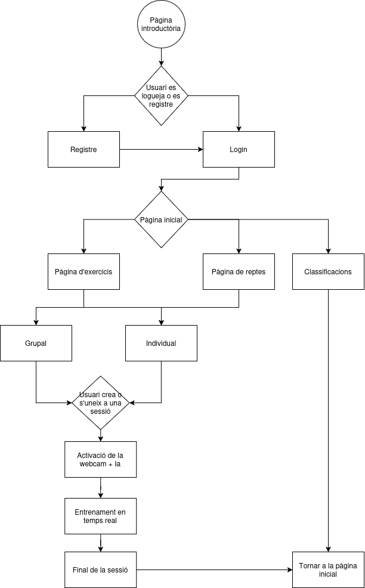
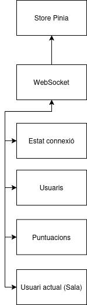
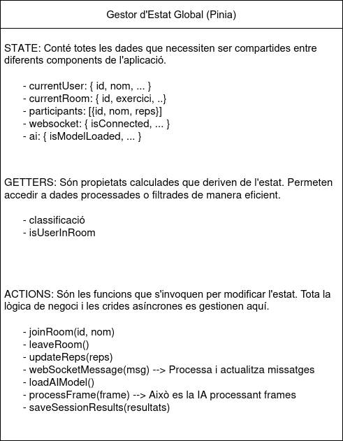
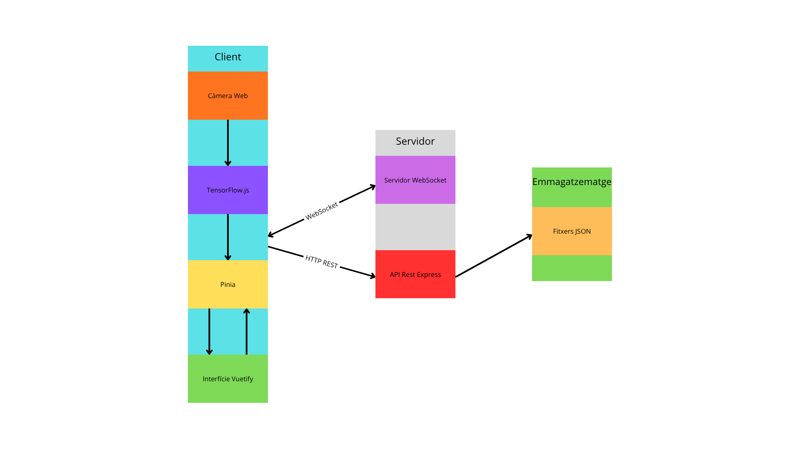

# Documentació
Llistat d'alguns dels punts que han de quedar explicats en aquesta carpeta. Poden ser tots en aquest fitxer o en diversos fitxers enllaçats.

És obligatori modificar aquest document!!

## Documentació bàsica MÍNIMA
 * Objectius
 * Arquitectura bàsica
   * Tecnologies utilitzades
   * Interrelació entre els diversos components
 * Com crees l'entorn de desenvolupament
 * Com desplegues l'aplicació a producció
 * Llistat d'endpoints de l'API de backend (també podeu documentar-ho amb swagger)
    * Rutes
   * Exemples de JSON de peticó
   * Exemples de JSON de resposta i els seus codis d'estat 200? 404?
 * Aplicació Android
 * Altres elements importants.
 * ...

---

## Diagrames

Aquí pots veure els diagrames del projecte:

**Diagrama de flux d'usuari**

**Esquema inicial Store de Pinia**

**Diagrama Pinia**

**Diagrama del Sistema**

### Gestor d'Estat Global (Pinia) TO DO

## Protocols

**Protocol de comunicació amb Esdeveniments definits**

| Esdeveniment (type) | Direcció | Descripció | Camps (data) |
|---|---|---|---|
| `join_room` | Client → Servidor | L'usuari sol·licita unir-se a una sala concreta. | `username`, `room` |
| `room_joined` | Servidor → Client | El servidor confirma la unió a la sala i retorna la llista d'usuaris actuals. | `room`, `participants[]` |
| `update_reps` | Client → Servidor | L'usuari envia el nombre actual de repeticions realitzades. | `username`, `reps` |
| `leaderboard_update` | Servidor → Client | El servidor envia el rànquing actualitzat de tots els participants. | `leaderboard[]` |
| `error` | Servidor → Client | El servidor notifica un error (p. ex. sala inexistent). | `message` |
| `disconnect` | Client → Servidor | L'usuari es desconnecta o abandona la sala. | `username` |

## Documentacions

**Documentació de la Lógica de la IA**

Aqui podres veure la documentació de la definició conceptual de com comptarem les repeticions de cada exercici.

[Lógica de la IA.pdf](https://github.com/user-attachments/files/23208034/Logica.de.la.IA.pdf)

**Esbossos (Wireframes) amb Vuetify**

Fent click al en aquest link, podres veure els esbossos de la nostra aplicació amb Vuetify

[FitIA.pdf](https://github.com/user-attachments/files/23208026/FitIA.pdf)
